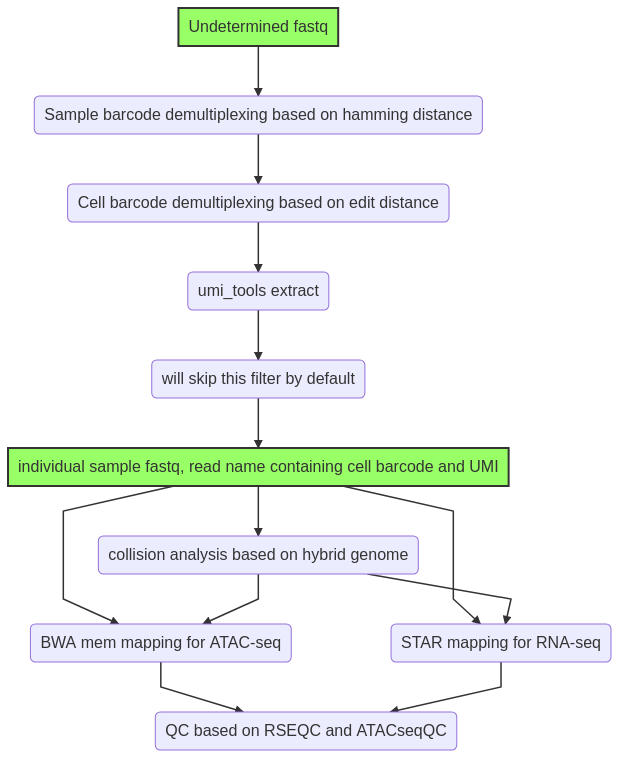

# TEST data is unpublished. Feel free to use the code. But contact us before using the example data. Thanks!

# SHARE-seq analysis pipeline



Python and Bash code. 


Current steps are:

1. Demultiplexing by sample barcode (`-f1 input.tsv`)

Output: ATAC-seq and RNA-seq data

2. Extract cell barcode (`-f2 barcode1.list`)

Output: reformatted fastq files

3. (for RNA-seq), extract UMI and filter polyT

4. BWA-mem (PE reads) and STAR mapping (only RNA_seq R1 read)

	 - 4.1. collision rate calculation for ATAC-seq and RNA-seq


# Usage

```

module load conda3/202011

source activate /home/yli11/.conda/envs/cutadaptenv

module load samtools/1.7 star bedtools/2.29.2 R/3.5.1


bsub -o output.log -e error.log -q priority -P Genomics -R 'rusage[mem=60000]' -J SHARE python shareseq2.py -f1 input.tsv -f2 barcode1.list -r1 Undetermined_S0_L001_R1_001.fastq.gz -r2 Undetermined_S0_L001_R2_001.fastq.gz -n 1 --min_reads_per_cell 10

```

To run a quick example:

```

module load conda3/202011

source activate /home/yli11/.conda/envs/cutadaptenv

module load samtools/1.7 star bedtools/2.29.2 R/3.5.1

python shareseq.py -f1 input.tsv -f2 barcode1.list -r1 test.10K.R1.fastq.gz -r2 test.10K.R2.fastq.gz --collision -n 0 --min_reads_per_cell 0
```

